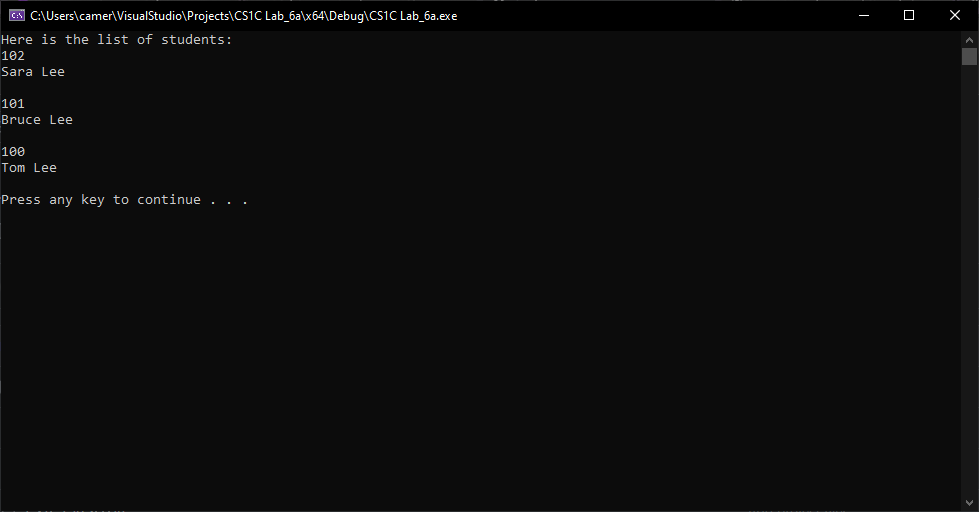

# Simple Stack with Linked List
## About
This program uses a declared Student struct with id:int, name:string, and next:Student* members in order to create a stack linked list. The program will ask the user to insert new students into the linked list and will prompt the user for the new student's name and id and store it in a Student object that is added to the head of the linked list. When the user is done adding students, the program will display the newly created stack of students. Next, it will ask if the user would like to delete any students from the stack. If the user chooses yes, the program will prompt the user for the id number of the students they want to delete from the stack. The program will verify if the id is in the current stack and remove the student if found. The program will then display the update student stack

## Current Build

## Functions
### insertStudent(Student*& head)
This function receives the head of the stack of students, which is initialized to NULL before any students are inserted. The function creates a new student pointer pointing to a dynamic student object. Next the function prompts the user to enter the student's name and id and stores them into the corresponding student object members, name and id. The student next pointer is then assigned to the head of the stack and head is reassigned to the newly created student object.

### deleteStudent(Student*& head)
This function receives the head of the stack and assigns it to a student pointer and prompts the user for the id of a student they want to delete from the stack. The function descends the stack comparing the object id members to the user input id using the next pointer student member. If the id is found the surrounding nodes will be reassigned and the matching node will be deleted.

### showLtoR
This function receives the head of the stack and outputs each item in descending order to the console. See the current build chapter as an example.
